# 后台管理系统技术架构流程图

本文档通过流程图的方式展示系统的技术架构，帮助开发团队更好地理解系统设计。

## 1. 整体技术架构图

### 1.1 系统分层架构

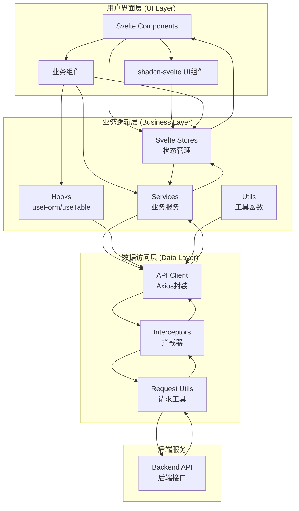
```mermaid
graph TB
    subgraph "用户界面层 (UI Layer)"
        A[Svelte Components]
        B[shadcn-svelte UI组件]
        C[业务组件]
        A --> B
        A --> C
    end
    
    subgraph "业务逻辑层 (Business Layer)"
        D[Svelte Stores<br/>状态管理]
        E[Services<br/>业务服务]
        F[Hooks<br/>useForm/useTable]
        G[Utils<br/>工具函数]
    end
    
    subgraph "数据访问层 (Data Layer)"
        H[API Client<br/>Axios封装]
        I[Interceptors<br/>拦截器]
        J[Request Utils<br/>请求工具]
    end
    
    subgraph "后端服务"
        K[Backend API<br/>后端接口]
    end
    
    A --> D
    B --> D
    C --> D
    C --> E
    C --> F
    D --> E
    E --> H
    F --> H
    G --> H
    H --> I
    I --> J
    J --> K
    K --> J
    J --> I
    I --> H
    H --> E
    E --> D
    D --> A
```

### 1.2 技术栈架构

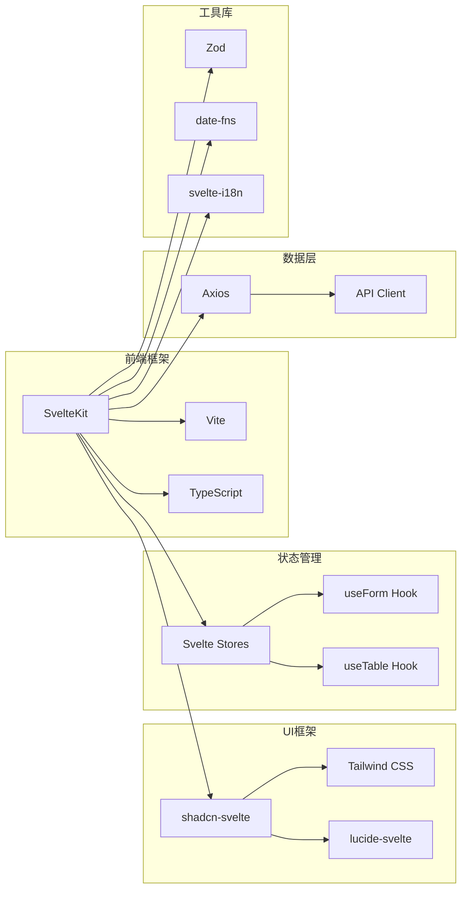
```mermaid
graph LR
    subgraph "前端框架"
        A[SvelteKit]
        B[Vite]
        C[TypeScript]
    end
    
    subgraph "UI框架"
        D[shadcn-svelte]
        E[Tailwind CSS]
        F[lucide-svelte]
    end
    
    subgraph "状态管理"
        G[Svelte Stores]
        H[useForm Hook]
        I[useTable Hook]
    end
    
    subgraph "数据层"
        J[Axios]
        K[API Client]
    end
    
    subgraph "工具库"
        L[Zod]
        M[date-fns]
        N[svelte-i18n]
    end
    
    A --> B
    A --> C
    D --> E
    D --> F
    G --> H
    G --> I
    J --> K
    A --> D
    A --> G
    A --> J
    A --> L
    A --> M
    A --> N
```

## 2. 数据流架构图

### 2.1 请求响应数据流

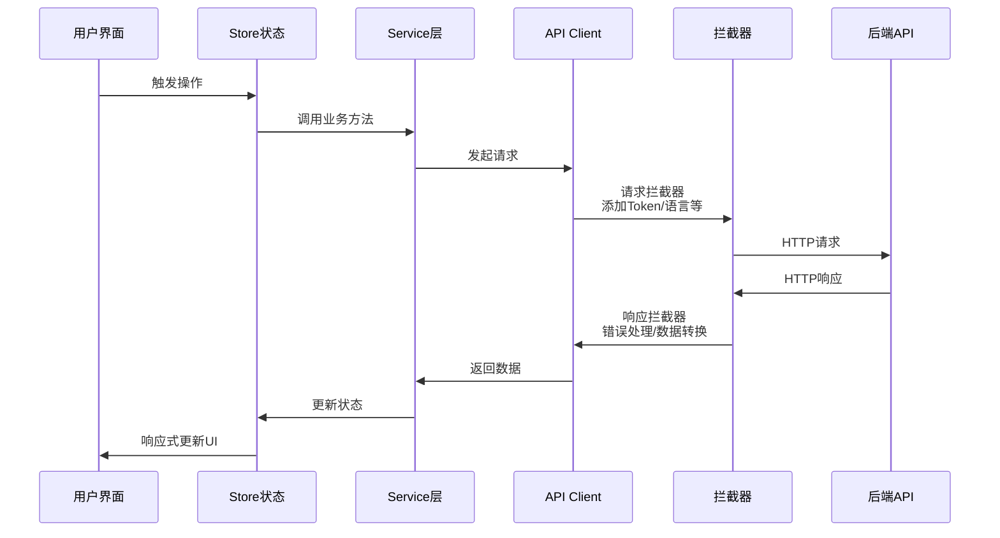
```mermaid
sequenceDiagram
    participant UI as 用户界面
    participant Store as Store状态
    participant Service as Service层
    participant API as API Client
    participant Interceptor as 拦截器
    participant Backend as 后端API
    
    UI->>Store: 触发操作
    Store->>Service: 调用业务方法
    Service->>API: 发起请求
    API->>Interceptor: 请求拦截器<br/>添加Token/语言等
    Interceptor->>Backend: HTTP请求
    Backend->>Interceptor: HTTP响应
    Interceptor->>API: 响应拦截器<br/>错误处理/数据转换
    API->>Service: 返回数据
    Service->>Store: 更新状态
    Store->>UI: 响应式更新UI
```

### 2.2 状态管理数据流

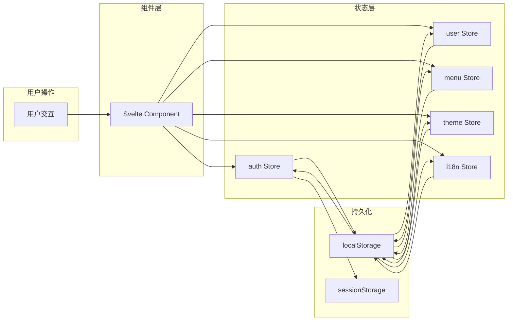
```mermaid
graph LR
    subgraph "用户操作"
        A[用户交互]
    end
    
    subgraph "组件层"
        B[Svelte Component]
    end
    
    subgraph "状态层"
        C[auth Store]
        D[user Store]
        E[menu Store]
        F[theme Store]
        G[i18n Store]
    end
    
    subgraph "持久化"
        H[localStorage]
        I[sessionStorage]
    end
    
    A --> B
    B --> C
    B --> D
    B --> E
    B --> F
    B --> G
    C --> H
    D --> H
    E --> H
    F --> H
    G --> H
    C --> I
    H --> C
    H --> D
    H --> E
    H --> F
    H --> G
```

## 3. 组件层次结构图

### 3.1 页面组件结构

```mermaid
graph TB
    subgraph "路由层"
        A[+layout.svelte<br/>根布局]
        B[(auth)/<br/>认证路由组]
        C[(dashboard)/<br/>后台路由组]
    end
    
    subgraph "布局组件"
        D[MainLayout]
        E[Header]
        F[Sidebar]
        G[Breadcrumb]
    end
    
    subgraph "业务组件"
        H[LoginForm]
        I[RegisterForm]
        J[MenuTree]
        K[UserDropdown]
    end
    
    subgraph "UI组件"
        L[Button]
        M[Input]
        N[Table]
        O[Form]
        P[Dialog]
    end
    
    A --> D
    B --> H
    B --> I
    C --> D
    D --> E
    D --> F
    D --> G
    D --> C
    E --> K
    F --> J
    H --> L
    H --> M
    I --> O
    J --> L
    K --> P
    C --> N
    C --> O
```

### 3.2 Form组件架构

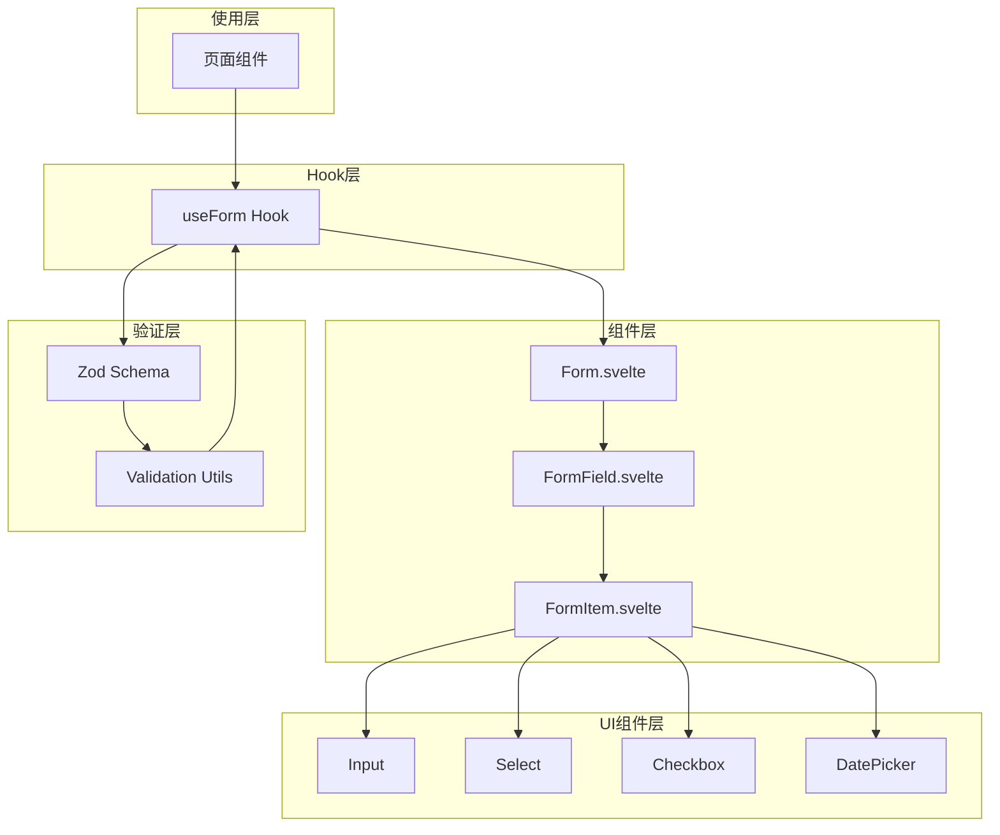
```mermaid
graph TB
    subgraph "使用层"
        A[页面组件]
    end
    
    subgraph "Hook层"
        B[useForm Hook]
    end
    
    subgraph "组件层"
        C[Form.svelte]
        D[FormField.svelte]
        E[FormItem.svelte]
    end
    
    subgraph "UI组件层"
        F[Input]
        G[Select]
        H[Checkbox]
        I[DatePicker]
    end
    
    subgraph "验证层"
        J[Zod Schema]
        K[Validation Utils]
    end
    
    A --> B
    B --> C
    C --> D
    D --> E
    E --> F
    E --> G
    E --> H
    E --> I
    B --> J
    J --> K
    K --> B
```

### 3.3 Table组件架构

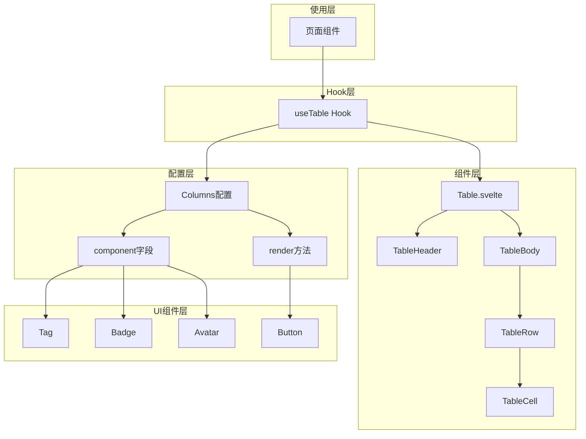
```mermaid
graph TB
    subgraph "使用层"
        A[页面组件]
    end
    
    subgraph "Hook层"
        B[useTable Hook]
    end
    
    subgraph "组件层"
        C[Table.svelte]
        D[TableHeader]
        E[TableBody]
        F[TableRow]
        G[TableCell]
    end
    
    subgraph "配置层"
        H[Columns配置]
        I[component字段]
        J[render方法]
    end
    
    subgraph "UI组件层"
        K[Tag]
        L[Badge]
        M[Avatar]
        N[Button]
    end
    
    A --> B
    B --> C
    C --> D
    C --> E
    E --> F
    F --> G
    B --> H
    H --> I
    H --> J
    I --> K
    I --> L
    I --> M
    J --> N
```

## 4. 认证流程圖

### 4.1 登录流程

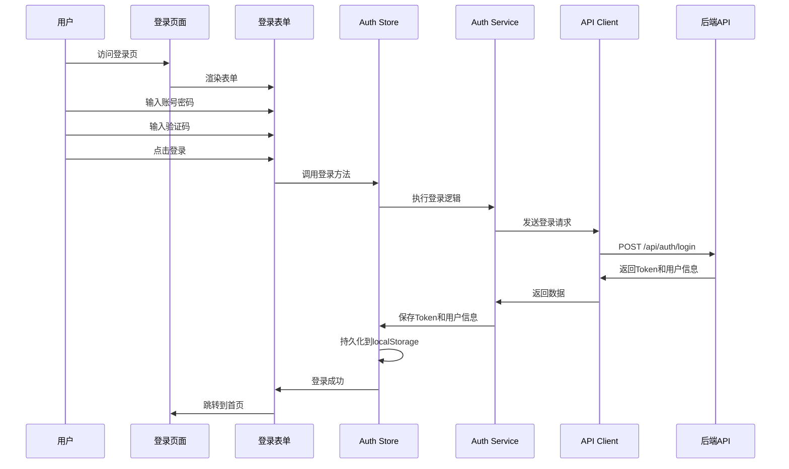
```mermaid
sequenceDiagram
    participant User as 用户
    participant LoginPage as 登录页面
    participant LoginForm as 登录表单
    participant AuthStore as Auth Store
    participant AuthService as Auth Service
    participant API as API Client
    participant Backend as 后端API
    
    User->>LoginPage: 访问登录页
    LoginPage->>LoginForm: 渲染表单
    User->>LoginForm: 输入账号密码
    User->>LoginForm: 输入验证码
    User->>LoginForm: 点击登录
    LoginForm->>AuthStore: 调用登录方法
    AuthStore->>AuthService: 执行登录逻辑
    AuthService->>API: 发送登录请求
    API->>Backend: POST /api/auth/login
    Backend->>API: 返回Token和用户信息
    API->>AuthService: 返回数据
    AuthService->>AuthStore: 保存Token和用户信息
    AuthStore->>AuthStore: 持久化到localStorage
    AuthStore->>LoginForm: 登录成功
    LoginForm->>LoginPage: 跳转到首页
```

### 4.2 权限检查流程

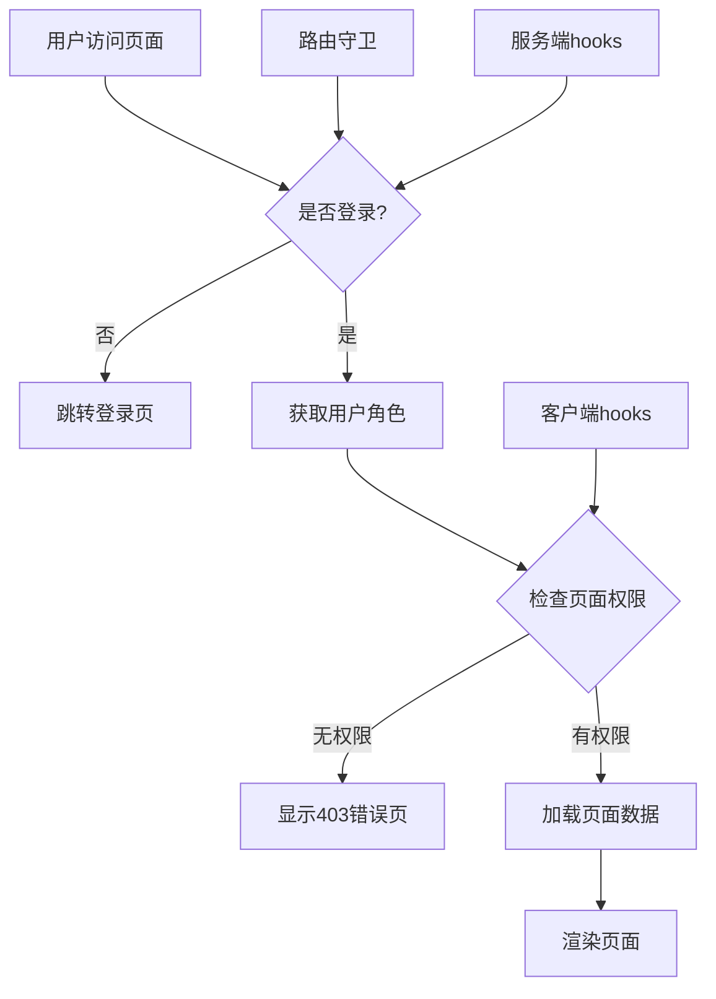
```mermaid
flowchart TD
    A[用户访问页面] --> B{是否登录?}
    B -->|否| C[跳转登录页]
    B -->|是| D[获取用户角色]
    D --> E{检查页面权限}
    E -->|无权限| F[显示403错误页]
    E -->|有权限| G[加载页面数据]
    G --> H[渲染页面]
    
    I[路由守卫] --> B
    J[服务端hooks] --> B
    K[客户端hooks] --> E
```

## 5. 菜单加载流程圖

### 5.1 菜单配置加载流程

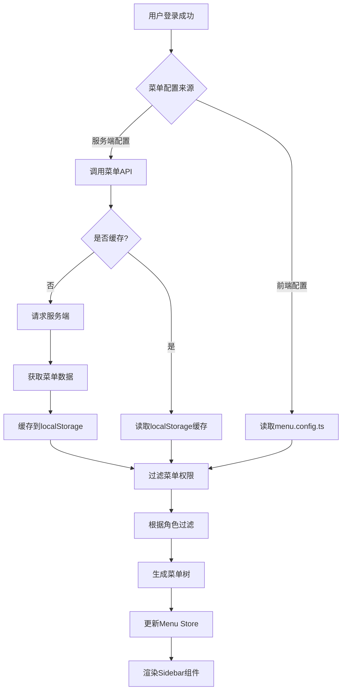
```mermaid
flowchart TD
    A[用户登录成功] --> B{菜单配置来源}
    B -->|服务端配置| C[调用菜单API]
    B -->|前端配置| D[读取menu.config.ts]
    
    C --> E{是否缓存?}
    E -->|是| F[读取localStorage缓存]
    E -->|否| G[请求服务端]
    
    G --> H[获取菜单数据]
    H --> I[缓存到localStorage]
    I --> J[过滤菜单权限]
    
    F --> J
    D --> J
    
    J --> K[根据角色过滤]
    K --> L[生成菜单树]
    L --> M[更新Menu Store]
    M --> N[渲染Sidebar组件]
```

### 5.2 菜单搜索流程

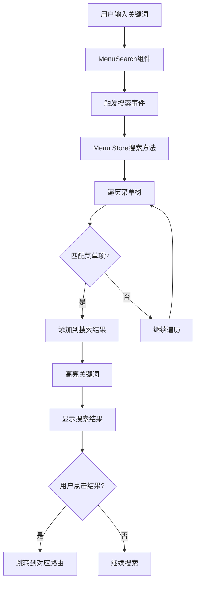
```mermaid
flowchart TD
    A[用户输入关键词] --> B[MenuSearch组件]
    B --> C[触发搜索事件]
    C --> D[Menu Store搜索方法]
    D --> E[遍历菜单树]
    E --> F{匹配菜单项?}
    F -->|是| G[添加到搜索结果]
    F -->|否| H[继续遍历]
    H --> E
    G --> I[高亮关键词]
    I --> J[显示搜索结果]
    J --> K{用户点击结果?}
    K -->|是| L[跳转到对应路由]
    K -->|否| M[继续搜索]
```

## 6. 主题切换流程圖

### 6.1 主题色切换流程

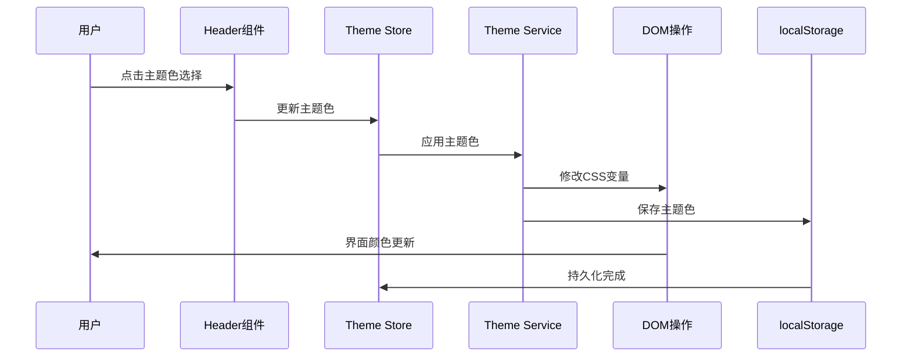
```mermaid
sequenceDiagram
    participant User as 用户
    participant Header as Header组件
    participant ThemeStore as Theme Store
    participant ThemeService as Theme Service
    participant DOM as DOM操作
    participant Storage as localStorage
    
    User->>Header: 点击主题色选择
    Header->>ThemeStore: 更新主题色
    ThemeStore->>ThemeService: 应用主题色
    ThemeService->>DOM: 修改CSS变量
    ThemeService->>Storage: 保存主题色
    DOM->>User: 界面颜色更新
    Storage->>ThemeStore: 持久化完成
```

### 6.2 黑白模式切换流程

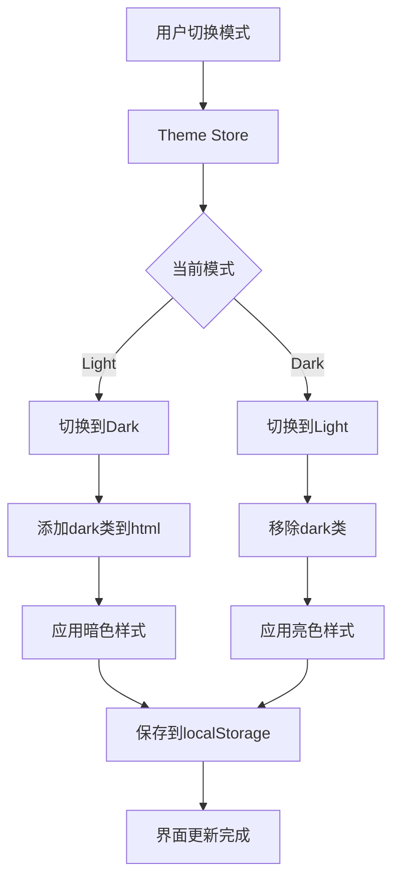
```mermaid
flowchart TD
    A[用户切换模式] --> B[Theme Store]
    B --> C{当前模式}
    C -->|Light| D[切换到Dark]
    C -->|Dark| E[切换到Light]
    
    D --> F[添加dark类到html]
    E --> G[移除dark类]
    
    F --> H[应用暗色样式]
    G --> I[应用亮色样式]
    
    H --> J[保存到localStorage]
    I --> J
    
    J --> K[界面更新完成]
```

## 7. 国际化流程圖

### 7.1 语言切换流程

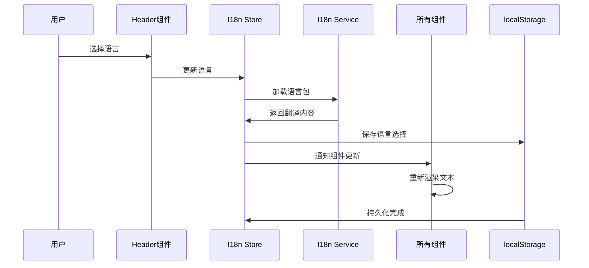
```mermaid
sequenceDiagram
    participant User as 用户
    participant Header as Header组件
    participant I18nStore as I18n Store
    participant I18nService as I18n Service
    participant Components as 所有组件
    participant Storage as localStorage
    
    User->>Header: 选择语言
    Header->>I18nStore: 更新语言
    I18nStore->>I18nService: 加载语言包
    I18nService->>I18nStore: 返回翻译内容
    I18nStore->>Storage: 保存语言选择
    I18nStore->>Components: 通知组件更新
    Components->>Components: 重新渲染文本
    Storage->>I18nStore: 持久化完成
```

## 8. HTTP请求流程圖

### 8.1 请求拦截和处理流程

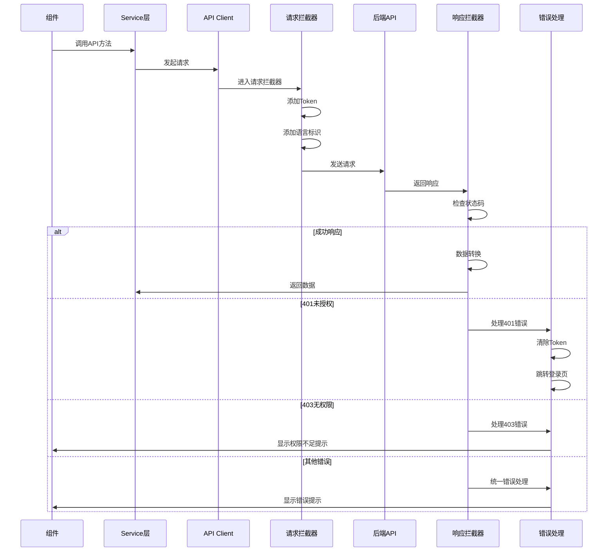
```mermaid
sequenceDiagram
    participant Component as 组件
    participant Service as Service层
    participant API as API Client
    participant RequestInterceptor as 请求拦截器
    participant Backend as 后端API
    participant ResponseInterceptor as 响应拦截器
    participant ErrorHandler as 错误处理
    
    Component->>Service: 调用API方法
    Service->>API: 发起请求
    API->>RequestInterceptor: 进入请求拦截器
    RequestInterceptor->>RequestInterceptor: 添加Token
    RequestInterceptor->>RequestInterceptor: 添加语言标识
    RequestInterceptor->>Backend: 发送请求
    Backend->>ResponseInterceptor: 返回响应
    ResponseInterceptor->>ResponseInterceptor: 检查状态码
    alt 成功响应
        ResponseInterceptor->>ResponseInterceptor: 数据转换
        ResponseInterceptor->>Service: 返回数据
    else 401未授权
        ResponseInterceptor->>ErrorHandler: 处理401错误
        ErrorHandler->>ErrorHandler: 清除Token
        ErrorHandler->>ErrorHandler: 跳转登录页
    else 403无权限
        ResponseInterceptor->>ErrorHandler: 处理403错误
        ErrorHandler->>Component: 显示权限不足提示
    else 其他错误
        ResponseInterceptor->>ErrorHandler: 统一错误处理
        ErrorHandler->>Component: 显示错误提示
    end
```

## 9. 部署架构图

### 9.1 CSR部署架构

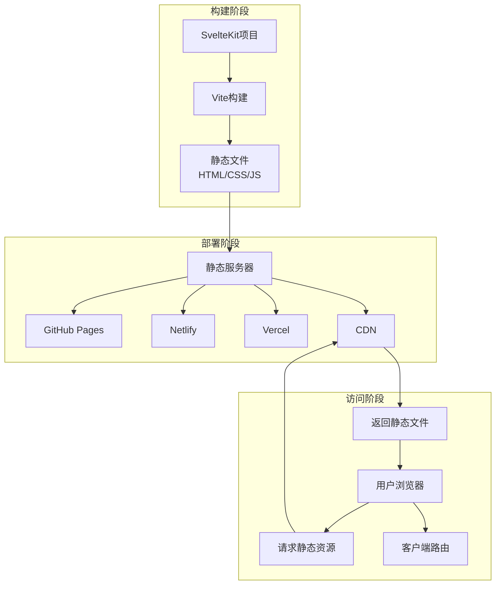
```mermaid
graph TB
    subgraph "构建阶段"
        A[SvelteKit项目] --> B[Vite构建]
        B --> C[静态文件<br/>HTML/CSS/JS]
    end
    
    subgraph "部署阶段"
        C --> D[静态服务器]
        D --> E[GitHub Pages]
        D --> F[Netlify]
        D --> G[Vercel]
        D --> H[CDN]
    end
    
    subgraph "访问阶段"
        I[用户浏览器] --> J[请求静态资源]
        J --> H
        H --> K[返回静态文件]
        K --> I
        I --> L[客户端路由]
    end
```

### 9.2 SSR部署架构

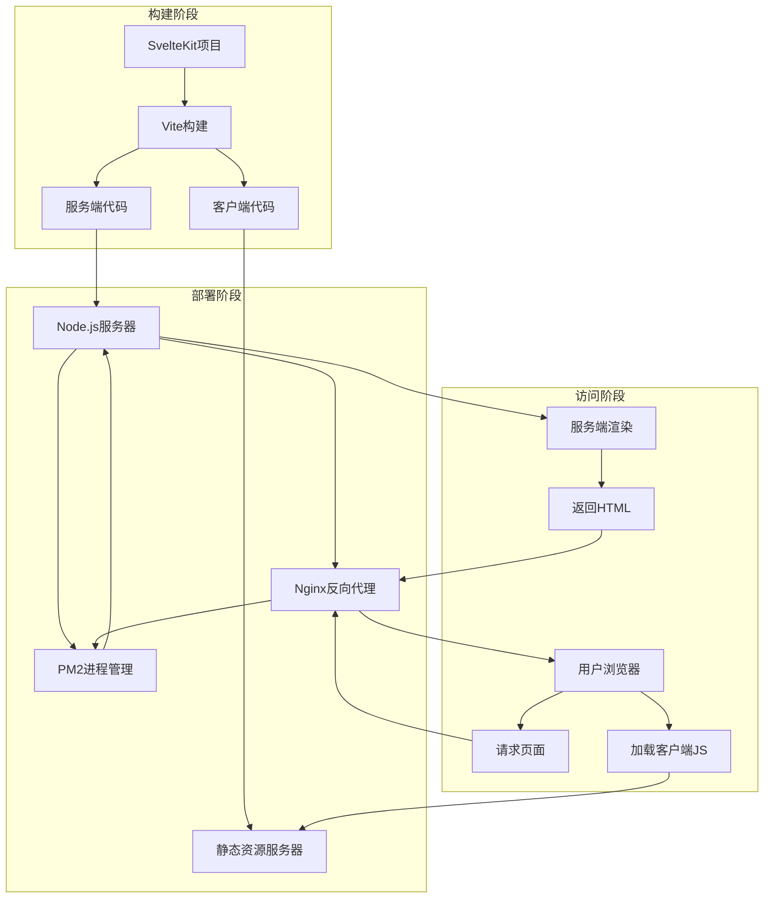
```mermaid
graph TB
    subgraph "构建阶段"
        A[SvelteKit项目] --> B[Vite构建]
        B --> C[服务端代码]
        B --> D[客户端代码]
    end
    
    subgraph "部署阶段"
        C --> E[Node.js服务器]
        D --> F[静态资源服务器]
        E --> G[PM2进程管理]
        E --> H[Nginx反向代理]
    end
    
    subgraph "访问阶段"
        I[用户浏览器] --> J[请求页面]
        J --> H
        H --> G
        G --> E
        E --> K[服务端渲染]
        K --> L[返回HTML]
        L --> H
        H --> I
        I --> M[加载客户端JS]
        M --> F
    end
```

### 9.3 混合部署架构

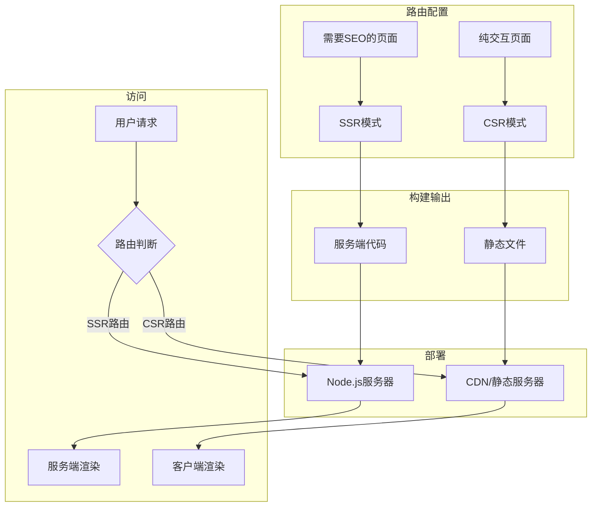
```mermaid
graph TB
    subgraph "路由配置"
        A[需要SEO的页面] --> B[SSR模式]
        C[纯交互页面] --> D[CSR模式]
    end
    
    subgraph "构建输出"
        B --> E[服务端代码]
        D --> F[静态文件]
    end
    
    subgraph "部署"
        E --> G[Node.js服务器]
        F --> H[CDN/静态服务器]
    end
    
    subgraph "访问"
        I[用户请求] --> J{路由判断}
        J -->|SSR路由| G
        J -->|CSR路由| H
        G --> K[服务端渲染]
        H --> L[客户端渲染]
    end
```

## 10. 表单处理流程圖

### 10.1 useForm Hook流程

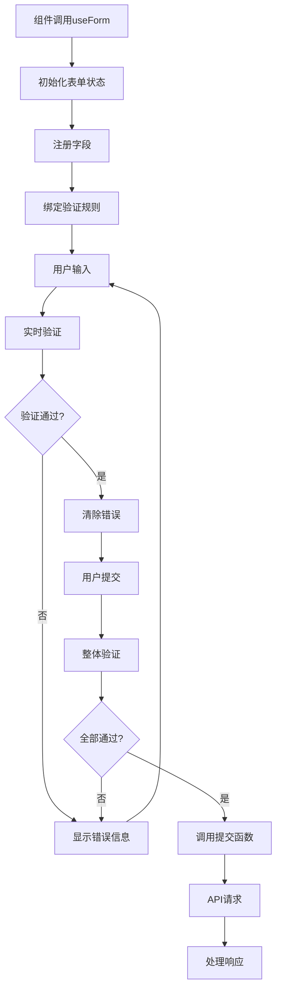
```mermaid
flowchart TD
    A[组件调用useForm] --> B[初始化表单状态]
    B --> C[注册字段]
    C --> D[绑定验证规则]
    D --> E[用户输入]
    E --> F[实时验证]
    F --> G{验证通过?}
    G -->|否| H[显示错误信息]
    G -->|是| I[清除错误]
    H --> E
    I --> J[用户提交]
    J --> K[整体验证]
    K --> L{全部通过?}
    L -->|否| H
    L -->|是| M[调用提交函数]
    M --> N[API请求]
    N --> O[处理响应]
```

### 10.2 Table组件渲染流程

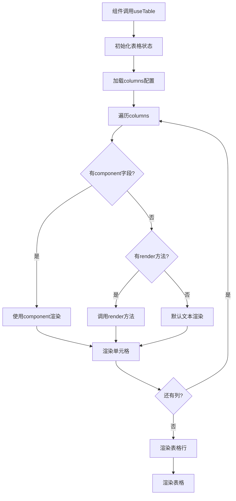
```mermaid
flowchart TD
    A[组件调用useTable] --> B[初始化表格状态]
    B --> C[加载columns配置]
    C --> D[遍历columns]
    D --> E{有component字段?}
    E -->|是| F[使用component渲染]
    E -->|否| G{有render方法?}
    G -->|是| H[调用render方法]
    G -->|否| I[默认文本渲染]
    F --> J[渲染单元格]
    H --> J
    I --> J
    J --> K{还有列?}
    K -->|是| D
    K -->|否| L[渲染表格行]
    L --> M[渲染表格]
```

## 11. 文件结构关系图

### 11.1 核心目录关系

```mermaid
graph TB
    subgraph "src/"
        A[routes/] --> B[页面路由]
        C[lib/] --> D[核心代码]
    end
    
    subgraph "lib/"
        D --> E[components/]
        D --> F[stores/]
        D --> G[services/]
        D --> H[api/]
        D --> I[hooks/]
        D --> J[utils/]
        D --> K[config/]
        D --> L[types/]
    end
    
    subgraph "components/"
        E --> M[ui/]
        E --> N[layout/]
        E --> O[form/]
        E --> P[table/]
        E --> Q[auth/]
        E --> R[menu/]
        E --> S[user/]
    end
    
    subgraph "依赖关系"
        B --> E
        B --> F
        E --> F
        E --> I
        F --> G
        G --> H
        I --> J
        E --> K
        F --> L
        G --> L
        H --> L
    end
```

## 12. 状态管理关系图

### 12.1 Store依赖关系

```mermaid
graph TB
    subgraph "Stores"
        A[auth.ts<br/>认证状态]
        B[user.ts<br/>用户信息]
        C[menu.ts<br/>菜单数据]
        D[theme.ts<br/>主题配置]
        E[i18n.ts<br/>国际化]
        F[app.ts<br/>应用状态]
    end
    
    subgraph "依赖关系"
        C --> A
        C --> B
        B --> A
        F --> A
        F --> B
        F --> C
        F --> D
        F --> E
    end
    
    subgraph "持久化"
        A --> G[localStorage]
        B --> G
        C --> G
        D --> G
        E --> G
    end
```

---

**文档版本**：v1.0  
**创建日期**：2025-01-27  
**最后更新**：2025-01-27

**说明**：本文档使用 Mermaid 语法绘制流程图，可在支持 Mermaid 的 Markdown 查看器中正常显示（如：GitHub、GitLab、VS Code 等）。

